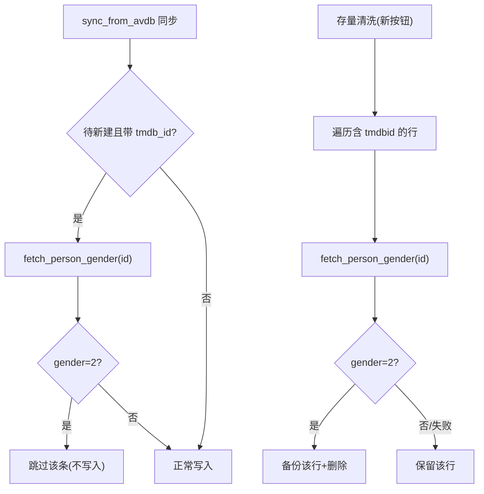

# 剔除男演员（TMDB gender 校验）

Feature Name: actor-db-filter-male
Updated: 2026-08-04

## Description

`actor_database.xlsx` 从 AVdb 同步混入了男优（AVdb 源无性别字段）。本功能以 TMDB person API 的 `gender` 为唯一权威性别来源，在两条链路剔除男演员：
1. **同步源头过滤**（`sync_from_avdb`）：写入新条目前校验 gender，男优跳过。
2. **存量清洗**：新工具遍历库中 tmdbid 校验 gender，删除男演员行。

## Architecture

## Components and Interfaces

### 1. `mdcx/core/tmdb_actor.py` — 新增 `fetch_person_gender`

- 签名：`async def fetch_person_gender(pid: int, base_url: str, api_key: str, client: Any) -> int | None`
- 请求 `/3/person/{pid}`（`language=zh-CN`），返回 `gender`（0/1/2）；请求失败或 404 返回 `None`。
- 复用 `_tmdb_request`（`tmdb_actor.py:319`）。内存缓存 `{pid: gender}` 避免重复请求。

### 2. `mdcx/tools/actor_db_tool.py` — `sync_from_avdb` 源头过滤

- 新增参数 `filter_male: bool = True`。
- 在「未匹配→新建」分支（写入 `ws.append` 前，`actor_db_tool.py:567` 附近）：若条目带 `tmdb_id` 且本地无此 tmdbid，调 `fetch_person_gender`；gender=2 → `result.skipped_male += 1`，日志输出「跳过男优」，不写入。
- 本地已有该 tmdbid → 复用本地已有判定（本地入库时已被校验），不再请求。
- TMDB 未配置（`_resolve_tmdb_config` 返回空 key）或请求失败 → 跳过校验直接写入（不误删），日志提示。

### 3. `mdcx/tools/actor_db_tool.py` — 新增 `clean_male_actors`

- 签名：`async def clean_male_actors() -> CleanActorResult`
- 遍历 `actor_database.xlsx` 中含 tmdbid 的行，滑动窗口并发（复用现有模式，并发 5）调 `fetch_person_gender`。
- gender=2：将该行内容备份追加到独立备份工作表（如 `男优备份` sheet）后删除行；gender 1/0/None/404 → 保留。
- 支持限量（`limit` 参数，默认如 5000 条/次）与手动停止（复用 `signal.stop` / `Flags`）。
- 写库持 `_actor_db_write_lock`，落盘后 `resources.reload_actor_db()`。
- 日志：每 10% 进度、剔除/保留/失败明细、汇总。

### 4. UI 接线（存量清洗入口）

- `mdcx/views/MDCx.ui`：`groupBox_actor_db_maintenance` 新增「剔除男演员」按钮 `pushButton_actor_db_clean_male`（放置于 AVdb 同步按钮下方）。
- `MDCx.py` 手工补控件；`main_window.py` 新增 `pushButton_actor_db_clean_male` pyqtSignal + `_run_actor_db_clean_male`（executor.submit + 信号恢复）；`tool_handlers.py` 新增 clicked 槽；`init.py` 接线。

## Data Models

- 复用 `resources.get_actor_data` / `search_actor_db_reverse` 定位行。
- 新增 `CleanActorResult` dataclass：`checked/removed_male/kept/failed`。
- 新增 `ActorDbSyncResult.skipped_male: int`（同步过滤计数）。

## Correctness Properties

- 仅 gender=2 删除/跳过；gender 0/1、请求失败、404、无 tmdbid 一律保留（Requirement 2.1-2.4）。
- 删除前先备份到独立 sheet，可复核（Requirement 3.4）。
- 同步过滤只针对「待新建且带 tmdb_id」条目，本地已存在条目不重复请求（Requirement 1.4）。
- TMDB 未配置/失败时不误删（Requirement 1.3）。
- 幂等：重复清洗只处理仍存在的男优（Requirement 3.2）。

## Error Handling

- `fetch_person_gender` 对 404/超时返回 `None`，调用方按「未知性别→保留」处理。
- 清洗中断：删除行已落盘不回滚；断点记录行索引，重启可续（Requirement 3.3，实现为进度游标）。
- 文件被占用/写库异常：记入失败明细，不中断整体流程。

## Test Strategy

新增 `tests/test_actor_db_filter_male.py`：

1. **sync 源头过滤**：mock `fetch_person_gender` 返回 2，断言男优条目未写入、`skipped_male` 计数正确。
2. **sync gender=1/0 正常写入**。
3. **sync TMDB 失败不误删**：`fetch_person_gender` 返回 None，条目仍写入。
4. **sync 本地已有 tmdbid 不重复请求**：断言 `fetch_person_gender` 未被调用。
5. **clean 剔除男优**：构造含 gender=2 行的库，清洗后行被删、备份 sheet 含该行。
6. **clean 保留女/未知/无 tmdbid**：gender 1/0/None/404 行保留。
7. **clean 幂等**：二次清洗不再删。
8. **clean 限量**：limit 生效。

## References

[^1]: (mdcx/core/tmdb_actor.py#L319) - `_tmdb_request` 基础请求
[^2]: (mdcx/core/tmdb_actor.py#L1191) - `/3/person/{pid}` person detail 请求示例（现用于按名搜索匹配）
[^3]: (mdcx/core/tmdb_actor.py#L1188) - `gender not in (0,1)` 现用于刮削排除男优
[^4]: (mdcx/tools/actor_db_tool.py#L132) - `_resolve_tmdb_config` 配置解析
[^5]: (mdcx/tools/actor_db_tool.py#L567) - sync 新建分支写入点
