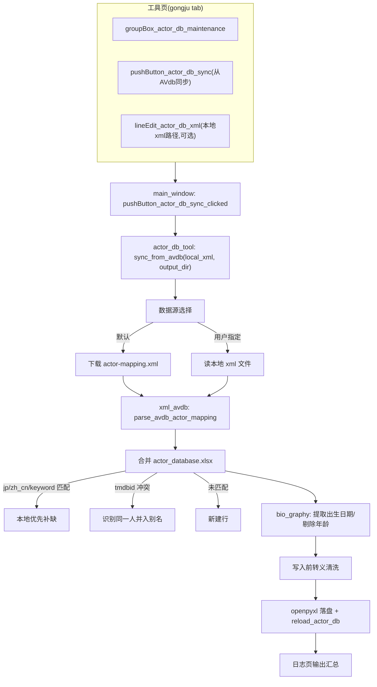

# 从 AVdb 同步演员映射（avdb-actor-sync）

Feature Name: 2026-08-04-avdb-actor-sync
Updated: 2026-08-04

## Description

在现有「演员库维护」工具（`mdcx/tools/actor_db_tool.py`）中新增「从 AVdb 同步」能力。数据源为 AVdb 项目（li-peifeng/Jav-Actors-Mapping）维护的 `actor-mapping.xml`——社区整理、CI 校验过的演员映射表。同步流程：下载或载入 xml → 解析 → 与 `actor_database.xlsx` 合并（本地优先补缺）→ tmdbid 冲突合并 → bio_graphy 解析出生日期/简介 → 写入前转义清洗 → 落盘重载。新增「出生日期」「简介」两列，老 xlsx 文件向后兼容。

设计决策摘要：

1. **直接消费 AVdb 成品数据**，自研拉取 TMDB person 导出做批量回填的工作量远大于直接转换其已校验的 xml，且数据一致性更好。
2. **网络 + 本地文件双数据源**：默认下载 GitHub raw，网络受限时允许用户选本地 xml 兜底。
3. **合并匹配顺序 jp → zh_cn → keyword**：jp 是现有 xlsx 主键，zh_cn/keyword 兜底同名不同写法的情况。
4. **tmdbid 冲突 = 合并而非报错**：不同 jp 名指向同一 tmdbid（演员改名）是导入时最常见的冲突，识别为同一人并入别名。
5. **bio_graphy 拆两列**：出生日期走 Emby/Jellyfin 原生 `PremiereDate`（静态字段），动态年龄剔除不写死；简介走 `Overview`。
6. **不引入 verified**：仅 AVdb 内部可信度标志，运行时无消费方。

## Architecture



## Components and Interfaces

### 1. 新增 `mdcx/utils/xml_avdb.py`（纯函数，无 UI/IO 依赖）

```
@dataclass
class AvdbActor:
    zh_cn: str
    zh_tw: str
    jp: str
    keyword: str          # 逗号分隔原始串，或 "" 
    tmdb_id: str
    bio_graphy: str
    birth_date: str       # 解析后 YYYY-MM-DD / YYYY-MM / ""
    bio: str              # 清洗后静态简介

def parse_avdb_actor_mapping(xml_text: str) -> list[AvdbActor]:
    """用标准库 xml.etree 解析 <actor-mapping>/<actor>/<a .../>，
    忽略 <actor-blacklist>。字段缺失一律返回空串，绝不抛错。"""

def extract_birth_date(bio_graphy: str) -> str:
    """正则提取出生日期，覆盖 YYYY年M月D日 / YYYY.M.D / YYYY/M/D 变体，
    归一化为 YYYY-MM-DD；仅年份则 YYYY；无则返回空串。"""

def strip_age_and_birth(bio_graphy: str, birth_date: str) -> str:
    """剔除 '\\d+岁' 年龄片段与已提取的出生段，保留其余静态文本。"""

def clean_actor_value(value: str) -> str:
    """写入前统一转义清洗：html.unescape 解码重复实体 → 去换行/\\t/\\x00-\\x1F 控制字符
    → 剥离字面 \\uXXXX/\\xNN/\\n 反斜杠串 → trim。对应 AVdb SUSPICIOUS_ESCAPE_RE 思路。"""
```

- 全部使用标准库（`xml.etree.ElementTree`、`html`、`re`），符合 Windows 单 exe 打包「不新增三方依赖」约束。
- `AvdbActor` 是纯数据类，下游合并逻辑与 XML 格式解耦。

### 2. 扩展 `mdcx/tools/actor_db_tool.py`

```
@dataclass
class ActorDbSyncResult:
    downloaded: bool
    parsed: int          # xml 解析出的条目数
    created: int         # 新建行数
    filled: int          # 补齐字段条目数
    merged: int          # tmdbid 冲突合并数
    failed: list[tuple[str, str]]  # (条目显示名, reason)

# 数据源：默认 GitHub 直连，可切换到 jsDelivr CDN 加速（国内可直连），或填自定义/代理加速地址
AVDB_MAPPING_URL = "https://raw.githubusercontent.com/li-peifeng/Jav-Actors-Mapping/main/actor-mapping.xml"
AVDB_MAPPING_URL_MIRROR = "https://cdn.jsdelivr.net/gh/li-peifeng/Jav-Actors-Mapping@main/actor-mapping.xml"

async def sync_from_avdb(
    source: str,          # "jsdelivr" | "github" | "url" | "file"
    value: str = "",      # source="url" 时为下载地址，source="file" 时为本地 xml 路径
    output_dir: Path | None = None,
) -> ActorDbSyncResult:
    """1) 数据源：source="file" 且文件存在则读本地 xml；source="jsdelivr"/"github" 用内置
    AVDB_MAPPING_URL_MIRROR / AVDB_MAPPING_URL；source="url" 用 value 指定的地址，复用项目下载能力。
    2) parse_avdb_actor_mapping 解析。3) 加载 actor_database.xlsx（复用 _get_db_path + _wb 预加载模式）。
    4) 合并 + bio 解析 + 清洗 + 写库。5) _flush_wb + resources.reload_actor_db。"""
```

- 下载复用 `..base.web` 现有网络层（`download_file_with_filepath`），不新增 HTTP 客户端；该层 async_client 构建时已带 `manager.config.proxy`（`config/computed.py:25`），用户启用「设置-网络-代理」后自动走代理，无需额外传参。
- 写库串行化复用 `_actor_db_write_lock`（`tmdb_actor.py:35`）。
- 合并匹配顺序：jp 精确 → zh_cn 精确 → keyword 命中（大小写不敏感），全部未中则新建行。
- 新建行按 `ws.append([jp, zh_cn, zh_tw, keyword, href, tmdbid, tmdb_url, birth_date, bio])` 补满 9 列。

### 3. 修改 `mdcx/config/resources.py` — 列常量与表头

```
COL_JP=0 ... COL_TMDB_URL=6        # 原有不动
COL_BIRTH_DATE = 7
COL_BIO = 8
DB_HEADERS = ["日文原名", "中文名", "繁体名", "别名", "链接", "tmdbid", "tmdb url", "出生日期", "简介"]
```

- 新列追加在末尾，**不重排现有列**，避免打乱 `tmdb_actor.py`/`actor_db_tool.py` 既有按常量取列的代码。
- `get_actor_data` 返回值新增 `birth_date`、`bio` 两个键（默认空串），供后续 Emby 演员简介写入消费。

### 4. 修改 `mdcx/core/tmdb_actor.py` — 老文件兼容读

- `read_actor_db_xlsx` 与 `load_actor_db`：读取行宽少于 `len(DB_HEADERS)` 时，缺失列按空值处理（现有 `COL_JP` 起步的取值方式已隐含兼容，需为新增两列补显式 `or ""`）。
- `update_actor_db_row`：追加 `birth_date`、`bio` 两个可写参数（默认 None，仅本地为空时填充），与现有「已有值不覆盖」语义一致。
- `_format_db_worksheet` 列宽计算（`scraper.py:502` 同源）：列数上限由 `len(DB_HEADERS)` 驱动，自动适配 9 列。

### 5. UI 与信号接线（`MDCx.ui` + `init.py` + `main_window.py`）

在现有 `groupBox_actor_db_maintenance`（y=1240, h=200）内部新增控件，不改 groupBox 整体高度，避免联动下移其他 groupBox：

| 控件 | 类型 | 显示文字/占位符 | 说明 |
|---|---|---|---|
| `label_actor_db_sync_desc` | QLabel | 青色说明：`从 AVdb 演员映射库同步数据，补齐中文名、别名、出生日期与演员简介。网络下载需能访问 GitHub，可在「设置-网络」启用代理，或改用加速地址。` | 说明文字 |
| `comboBox_actor_db_source` | QComboBox | 项1「jsDelivr 加速」/ 项2「GitHub 直连」/ 项3「自定义下载地址」/ 项4「本地 xml 文件」 | 数据源单选，默认 jsDelivr 加速 |
| `lineEdit_actor_db_url` | QLineEdit | 占位符「填写任意 xml 下载地址（如加速镜像）」 | 仅选「自定义下载地址」时显示 |
| `lineEdit_actor_db_xml` | QLineEdit | 占位符「选择本地 actor-mapping.xml」 | 仅选「本地 xml 文件」时显示 |
| `pushButton_actor_db_pick_xml` | QPushButton | 「选择本地 xml」 | 文件对话框，回填 `lineEdit_actor_db_xml` |
| `pushButton_actor_db_sync` | QPushButton | 「从 AVdb 同步」 | 运行 `sync_from_avdb` |

三处一致原则（`MDCx.ui` 定义 → `pyuic6` 编译 `MDCx.py` → `init.py` 信号接线 clicked 槽 + setText 防重入）：

```
pushButton_actor_db_sync.clicked.connect(pushButton_actor_db_sync_clicked)
pushButton_actor_db_pick_xml.clicked.connect(pushButton_actor_db_pick_xml_clicked)
comboBox_actor_db_source.currentIndexChanged.connect(_on_actor_db_source_changed)
```

- `pushButton_actor_db_sync_clicked`：读取数据源选择 → `executor.submit(sync_from_avdb(source, url_or_xml))` + 协程 finally 经 pyqtSignal 恢复按钮（跨线程 Qt 安全，`main_window.py:2619` 范式）。`sync_from_avdb` 参数映射：jsDelivr 加速 → `("url", AVDB_MAPPING_URL_MIRROR)`，GitHub 直连 → `("url", AVDB_MAPPING_URL)`，自定义下载地址 → `("url", lineEdit_actor_db_url 文本)`，本地 xml 文件 → `("file", lineEdit_actor_db_xml 文本)`。
- `_on_actor_db_source_changed`：仅选「自定义下载地址」时显示 `lineEdit_actor_db_url`，仅选「本地 xml 文件」时显示 `lineEdit_actor_db_xml` + 「选择本地 xml」按钮，其余隐藏。
- 同步按钮进度与结果走 `signal_qt.show_log_text` 通道（日志页 + 文件），符合「工具内部日志不得只写 LogBuffer」约束。

### 6. `scripts/build.py` 与工作流

- 新增 `--hidden-import mdcx.utils.xml_avdb`（与 `mdcx.tools.actor_db_tool` 同款延迟导入防护）。
- 不新增 `.github/workflows`：本仓库无社区 PR 流程，数据校验由本地 pre-commit 钩子承载（见下）。

### 7. 静态校验脚本 `scripts/check_actor_db.py`

挂入 pre-commit / `uv run check`，仅检查仓库内出厂 `resources/userdata/actor_database.xlsx`：

- 同 jp 名重复条目
- keyword 首尾逗号 / 连续逗号 / 重复词
- zh_cn/zh_tw/jp 空字段
- tmdbid 重复（指向两份以上数据错误）
- 出生日期列格式（空或 `YYYY[-MM[-DD]]`）

## Data Models

`actor_database.xlsx` 列（9 列）：

| 列 | 常量 | 说明 |
|---|---|---|
| 日文原名 | COL_JP=0 | 主键，读写按此匹配 |
| 中文名 | COL_ZH_CN=1 | AVdb 补齐源 |
| 繁体名 | COL_ZH_TW=2 | AVdb 补齐源 |
| 别名 | COL_KEYWORD=3 | 合并去重 |
| 链接 | COL_HREF=4 | 本地保留，AVdb 无此字段 |
| tmdbid | COL_TMDBID=5 | 冲突合并判据 |
| tmdb url | COL_TMDB_URL=6 | 本地保留 |
| **出生日期** | **COL_BIRTH_DATE=7** | 新增，bio_graphy 解析 |
| **简介** | **COL_BIO=8** | 新增，bio_graphy 静态部分 |

内存结构：`AvdbActor`（解析）、`ActorDbSyncResult`（同步汇总）。合并过程中的「条目显示名」取 jp → zh_cn → keyword 首个非空值。

## Correctness Properties

1. **写锁串行**：同步与刮削并发写 `actor_database.xlsx` 必须经 `_actor_db_write_lock` 串行化。
2. **本地优先**：合并只填空缺值，绝不覆盖本地已有 zh_cn/zh_tw/keyword/href/tmdbid。
3. **tmdbid 唯一性**：合并完成后，同一 tmdbid 至多对应一行；冲突条目并入而非新建。
4. **年龄不写死**：简介中不含「\d+岁」动态年龄；出生日期为独立结构化字段。
5. **老文件兼容**：列数不足的 xlsx 读取时不抛错，缺失列视为空。
6. **数据不脏**：所有写库字符串先过 `clean_actor_value`，xlsx 内不含重复实体转义/控制字符/字面反斜杠串。
7. **写盘失败不静默**：下载、解析、写盘任一失败均在日志页输出明确原因，落盘遵循 `_flush_wb`「失败不能静默吞掉」原则。

## Error Handling

| 场景 | 处理 |
|---|---|
| 网络下载失败/超时 | 日志页提示失败原因，引导用户切换到 jsDelivr 加速地址或选择本地 xml 文件，中止同步 |
| XML 解析失败 | 输出解析错误与行信息，不写库 |
| 本地文件不存在 | 日志页提示路径无效，中止 |
| 单个条目字段非法 | 记录失败原因，继续处理后续条目 |
| tmdbid 冲突 | 视为同一人，并入别名，日志页提示合并信息 |
| openpyxl 缺失 / xlsx 锁定 | 复用 `update_actor_db_row` 返回码（`missing_openpyxl`/`file_locked`），日志页输出 |
| 写盘失败 | 复用 `_flush_wb` 落盘失败处理，日志页输出，不静默 |

## Test Strategy

1. **单元测试** `tests/tools/test_avdb_actor_sync.py`：
   - `parse_avdb_actor_mapping`：构造最小 xml（含 `<a>` 多条、缺字段、含 `<actor-blacklist>`），验证解析与缺失字段空值化
   - `extract_birth_date`：`1993年06月05日`→`1993-06-05`、`1993.10.18`→`1993-10-18`、`1993/1/5`→`1993-01-05`、无日期→空串
   - `strip_age_and_birth`：剔除「33岁」「32岁」并保留身高三围等静态文本
   - `clean_actor_value`：`&amp;amp;`→`&`、控制字符/换行移除、`\\u4f50` 字面串剥离、trim
   - 合并逻辑：jp 匹配、zh_cn 匹配、keyword 匹配、未匹配新建、tmdbid 冲突并入别名、本地值不覆盖
   - 老文件兼容：构造 7 列 xlsx，验证读取不报错且新列返回空
2. **静态校验**：`scripts/check_actor_db.py` 对出厂 xlsx 跑通，并纳入 `uv run check` 回归。
3. **UI 验证（人工）**：工具页确认新按钮与既有 groupBox 无重叠、无遮挡。
4. **打包验证（人工）**：`scripts/build.py` 打包后确认 `mdcx.utils.xml_avdb` 可导入。

## References

[^1]: (Website) - [li-peifeng/Jav-Actors-Mapping 仓库说明与贡献规则](https://github.com/li-peifeng/Jav-Actors-Mapping)
[^2]: (mdcx/config/resources.py#L25-L33) - 现有 `COL_JP..COL_TMDB_URL` 与 `DB_HEADERS` 常量（扩展点）
[^3]: (mdcx/core/tmdb_actor.py#L662-L770) - `update_actor_db_row` 写入函数（追加新列参数）
[^4]: (mdcx/tools/actor_db_tool.py) - 演员库维护工具（新增 `sync_from_avdb`）
[^5]: (mdcx/controllers/main_window/main_window.py#L2584-L2626) - `_run_actor_db_tool` 与信号恢复范式（参照）
[^6]: (.monkeycode/specs/actor-db-maintenance/design.md) - 演员库维护工具既有规格（groupBox 布局参照）
