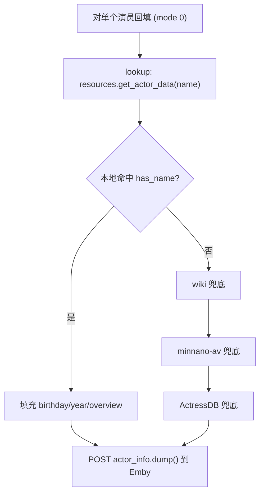

# 本地演员库回填 Emby 演员信息

Feature Name: emby-local-actor-info-backfill
Updated: 2026-08-04

## Description

Emby/Jellyfin 演员信息补全（`emby_actor_info.py:_process_actor_async`）目前依赖 wiki → minnano-av → 独立 ActressDB(SQLite) 三级网络兜底获取简介与生日。本功能在自动补全链路最前插入「本地演员库命中」判定：本地 `actor_database.xlsx` 命中时，直接用本地「出生日期」「简介」回填，不再发起外部网络请求；仅在本地未命中或字段为空时退回既有 wiki → minnano → ActressDB 流程。

## Architecture

## Components and Interfaces

### 1. `mdcx/tools/emby_actor_info.py` — `_process_actor_async`（`emby_actor_info.py:140`）

在演员基本信息获取、`emby_on` 跳过判断之后，`wiki` 步骤（`:166`）之前，插入本地查询与回填：

- 调用 `resources.get_actor_data(actor_name)` 获取本地索引数据。
- 若 `has_name` 为真，视为本地命中：
  - `birth_date` 非空 → `actor_info.birthday = birth_date`、`actor_info.year = birth_date[:4]`。
  - `bio` 非空 → `actor_info.overview = bio.replace("\n", " ")`；并清空 ActressDB 的「无维基百科信息」占位依赖（Overview 已是真实简介）。
  - `locations` 未设置时按 ActressDB 风格补 `["日本"]`（可选，保持一致性）。
- 若本地命中且简介/生日已填充，跳过 wiki/minnano/ActressDB 网络兜底。
- 返回标志沿用位掩码，**分配 bit3（值 8）表示本地命中**：`return 8 + (wiki_found) + (db_exist << 1) + (minnano_found << 2)`。原有 bit0/bit1/bit2 不变。

### 2. 返回值统计（`emby_actor_info.py:107-118`）

- 现有 `wiki += flag & 1`、`db += flag >> 1`、minnano 用 `flag & 4`。
- 本地命中 `flag` 含 bit3(8)。为避免 `flag >> 1` 把本地回填误计入 DB 计数，adjustment：`db += (flag >> 1) & 3`；并在最终汇总（`:116`）新增「本地库」计数 `local = sum(flag & 8)`，文案追加 `Local: {local}`。

### 3. 数据接收端 — `mdcx/models/emby.py` `EMbyActressInfo.dump()`

无需改动：`dump()` 已把 `birthday` → `PremiereDate`、`year` → `ProductionYear`、`overview` → `Overview`（`emby.py:29-31`）传给 Emby/Jellyfin。

## Data Models

- 复用 `EMbyActressInfo`（`mdcx/models/emby.py:5`），字段：`name`、`birthday`、`year`、`overview`、`locations`、`tags`、`provider_ids`。
- 复用 `resources.get_actor_data`（`resources.py:153`）返回键：`zh_cn`、`zh_tw`、`jp`、`keyword`、`href`、`birth_date`、`bio`、`has_name`。
- 本地库 9 列 schema：`COL_BIRTH_DATE=7`（`YYYY-MM-DD`）、`COL_BIO=8`。

## Correctness Properties

- 本地命中即不发起 wiki/minnano/ActressDB 网络请求（Requirement 2.1）。
- 本地简介非空 → Overview 用本地数据；本地生日非空 → PremiereDate 用本地数据（Requirement 2.1/2.2）。
- 本地命中但某字段为空 → 仅缺失字段退回外部来源，已有本地数据不被外部覆盖（Requirement 2.3）。
- Overview 换行一律转为 ` `，与现有 Emby 写法一致（Requirement 3.1）。
- PremiereDate 保持 `YYYY-MM-DD`，非空时覆盖 `0000-00-00` 默认值（Requirement 3.2）。
- 简介为空时不写入空串覆盖，保留占位或外部结果（Requirement 3.3）。

## Error Handling

- 本地查询异常（如 xlsx 未初始化）不得阻断流程：以 try/except 包裹，异常时记录日志并静默退回既有 wiki 兜底。
- 本地命中但 `bio` 清洗后为空 → 不设 Overview，让外部来源处理。
- 本地命中但日志输出失败不抛错，仅提示「本地库未命中」继续既有流程（Requirement 4.2）。

## Test Strategy

新增 `tests/test_emby_local_backfill.py`（或并入既有 emby 测试）：

1. **本地命中回填生日/简介**：mock `resources.get_actor_data` 返回带 `birth_date`/`bio` 的 `has_name=True` 记录，断言 `actor_info.birthday`/`year`/`overview` 被正确填充，且 Overview 换行已转 ` `。
2. **本地命中跳过外部来源**：mock wiki/minnano/ActressDB 调用，断言本地命中时这些来源不被调用。
3. **本地字段缺失退回外部**：本地命中但 `bio` 为空，断言仍走外部 Overview 兜底、生日仍用本地。
4. **本地未命中**：`has_name=False`，断言完全走既有 wiki→minnano→ActressDB 链路。
5. **返回标志**：本地命中返回 `flag & 8` 为真，且不破坏既有 wiki/db/minnano 统计位。
6. **本地查询异常**：`get_actor_data` 抛异常时，不阻断、退回外部来源。

## References

[^1]: (mdcx/tools/emby_actor_info.py#L140) - `_process_actor_async` 补全入口
[^2]: (mdcx/tools/emby_actor_info.py#L166) - wiki 兜底步骤
[^3]: (mdcx/tools/emby_actor_info.py#L204) - 返回位掩码 `wiki_found + (db_exist<<1) + (minnano_found<<2)`
[^4]: (mdcx/config/resources.py#L153) - `get_actor_data` 本地反查接口
[^5]: (mdcx/models/emby.py#L29) - `dump()` `PremiereDate`/`ProductionYear`/`Overview`
[^6]: (mdcx/tools/actress_db.py#L88) - 「无维基百科信息」Overview 占位
