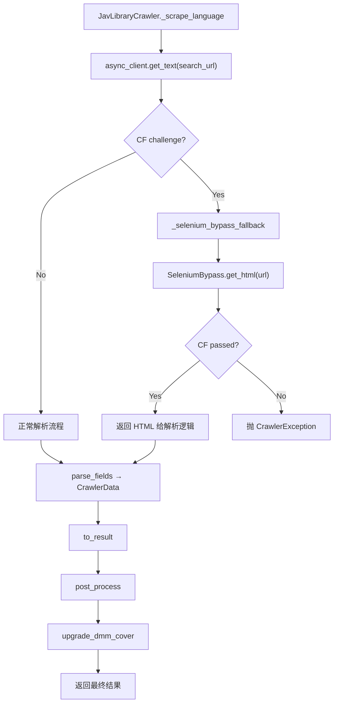

# JavLibrary Selenium CF Bypass + DMM 高清封面升级

Feature Name: javlibrary-selenium-cf-bypass
Updated: 2026-08-19

## Description

为 JavLibrary 爬虫集成 Selenium + Edge headless CF bypass 能力。当普通 HTTP 请求遇到 Cloudflare JS challenge 时，自动 fallback 到 Selenium+Edge 获取页面 HTML，并通过 CF 挑战。同时为 JavLibrary 补充 DMM 高清封面升级能力，与 JavBus/JavDB 等爬虫对齐。

经实测验证：
- Selenium+Edge headless 能稳定通过 JavLibrary 的 CF JS challenge（低级防护）
- cn/ja 双语言全字段刮削验证通过
- Selenium `page_source` 被浏览器自动补全 `<tbody>`，需将 xpath 从 `/table/tr/` 改为 `//`
- JavDB/Lulubar/MissAV 经实测 Selenium+Edge 方案无法自动过 CF，不在本特性范围

## Architecture



### 设计决策

1. **集成方式：JavLibrary 爬虫内部 fallback**。在 `javlibrary.py` 的 `_scrape_language` 方法内部，当 HTTP 请求检测到 CF challenge 时，调用 Selenium bypass 获取 HTML。不修改 `web_async.py` 通用逻辑，隔离性好。

2. **Driver 生命周期：每次新建+销毁**。每次 CF bypass 创建新 Edge 进程，完成后 `quit()`。简单可靠无状态泄漏，3-5 秒启动开销在 CF bypass 场景可接受。

3. **DMM 封面升级：post_process 阶段**。仿照 JavDB/JavBus 模式，在 `javlibrary.py` 添加 `post_process` 方法调用 `upgrade_dmm_cover`。

4. **xpath 统一改 `//`**：将 `javlibrary.py` 中所有 `/table/tr/` 路径改为 `//`，同时兼容 HTTP 和 Selenium 两种 HTML 来源。

5. **Selenium 作为可选依赖**：未安装时自动 `pip install`，无 Edge 时优雅降级。

## Components and Interfaces

### 1. SeleniumBypass 模块

新建 `mdcx/cf_bypass/selenium_adapter.py`，封装 Selenium+Edge 的 bypass 逻辑。

```python
class SeleniumBypass:
    """Selenium + Edge headless CF bypass 后端。"""

    @staticmethod
    def is_available() -> bool:
        """检查 Edge 浏览器和 selenium 包是否可用。"""

    @staticmethod
    async def get_html(url: str, *, timeout: int = 90) -> str | None:
        """用 Selenium+Edge headless 获取页面 HTML，自动过 CF。

        Args:
            url: 目标 URL
            timeout: 页面加载超时秒数

        Returns:
            过 CF 后的页面 HTML，失败返回 None
        """

    @staticmethod
    def _create_driver(foreground: bool = False):
        """创建 Edge driver，配置反检测参数。"""

    @staticmethod
    def _wait_cf_pass(driver, max_wait: int = 60) -> str:
        """等待 CF 挑战通过，返回页面 HTML。"""
```

**关键参数**（移植自已验证的 `edge_bypass_probe.py`）：
- `--headless=new`：新版 headless 模式
- `--disable-blink-features=AutomationControlled`：移除自动化标记
- `--disable-features=IsolateOrigins,site-per-process`：禁用站点隔离
- `--window-size=1920,1080`：固定窗口大小
- 真实 Edge UA：`Chrome/131.0.0.0 Safari/537.36 Edg/131.0.0.0`
- `page_load_strategy = "eager"`：DOM ready 即返回
- `set_page_load_timeout(90)`：90 秒超时

**CF 检测 markers**（与 `web_async.py:1115-1122` 对齐）：
```python
CF_MARKERS = (
    "just a moment",
    "cf-chl",
    "cdn-cgi/challenge-platform",
    "attention required",
    "enable javascript and cookies",
    "checking your browser before accessing",
)
```

### 2. JavLibraryCrawler 改造

#### 2.1 `_scrape_language` 方法增加 CF fallback

在 `javlibrary.py:210-268` 的 `_scrape_language` 方法中：

```python
async def _scrape_language(self, ctx: Context, language: Language, appoint_url: str = "") -> CrawlerData:
    number = ctx.input.number
    lang_path = language_path(language)
    domain_2 = f"{self.base_url}/{lang_path}"
    real_url = appoint_url

    if not real_url:
        search_url = f"{domain_2}/vl_searchbyid.php?keyword={number}"
        ctx.debug(f"搜索地址[{language.value}]: {search_url}")
        html_search, error = await self.async_client.get_text(search_url, use_proxy=self.use_proxy)
        
        # CF challenge 检测 + Selenium fallback
        if html_search is None or self._is_cf_html(html_search):
            ctx.debug("普通请求遇 CF challenge，尝试 Selenium bypass...")
            selenium_html = await self._selenium_bypass(ctx, search_url)
            if selenium_html:
                html_search = selenium_html
            else:
                raise CrawlerException("Selenium bypass 失败，CF 挑战未通过")

        html = etree.fromstring(html_search, etree.HTMLParser())
        real_url = get_real_url(html, number, domain_2)
        # ... 后续逻辑不变
```

#### 2.2 新增 `_selenium_bypass` 辅助方法

```python
async def _selenium_bypass(self, ctx: Context, url: str) -> str | None:
    """Selenium+Edge CF bypass fallback。"""
    from mdcx.cf_bypass.selenium_adapter import SeleniumBypass

    if not SeleniumBypass.is_available():
        ctx.debug("Selenium bypass 不可用（无 Edge 或 selenium 未安装）")
        return None

    try:
        html = await SeleniumBypass.get_html(url)
        if html and not self._is_cf_html(html):
            ctx.debug("Selenium bypass 成功")
            return html
        ctx.debug("Selenium bypass 后仍含 CF 标记")
        return None
    except Exception as e:
        ctx.debug(f"Selenium bypass 异常: {e}")
        return None
```

#### 2.3 新增 `post_process` 方法（DMM 封面升级）

```python
@override
async def post_process(self, ctx: Context, res: CrawlerResult) -> CrawlerResult:
    """DMM 高清封面升级。"""
    if res.number and not res.number.startswith("FC2"):
        from mdcx.crawlers.dmm_direct import upgrade_dmm_cover
        thumb, poster = await upgrade_dmm_cover(ctx, str(res.number), res.thumb, res.poster)
        res.thumb = thumb
        res.poster = poster
    return res
```

### 3. xpath 改造

将 `javlibrary.py` 中所有 xpath 从 `/table/tr/` 改为 `//`：

| 函数 | 原 xpath | 新 xpath |
|------|---------|---------|
| `get_actor` | `//div[@id="video_cast"]/table/tr/td[@class="text"]/span/span[@class="star"]/a/text()` | `//div[@id="video_cast"]//span[@class="star"]/a/text()` |
| `get_tag` | `//div[@id="video_genres"]/table/tr/td[@class="text"]/span/a/text()` | `//div[@id="video_genres"]//td[@class="text"]//span/a/text()` |
| `get_release` | `//div[@id="video_date"]/table/tr/td[@class="text"]/text()` | `//div[@id="video_date"]//td[@class="text"]/text()` |
| `get_runtime` | `//div[@id="video_length"]/table/tr/td/span[@class="text"]/text()` | `//div[@id="video_length"]//span[@class="text"]/text()` |
| `get_score` | `//div[@id="video_review"]/table/tr/td/span[@class="score"]/text()` | `//div[@id="video_review"]//span[@class="score"]/text()` |
| `get_studio` | `//div[@id="video_maker"]/table/tr/td[@class="text"]/span/a/text()` | `//div[@id="video_maker"]//td[@class="text"]/span/a/text()` |
| `get_publisher` | `//div[@id="video_label"]/table/tr/td[@class="text"]/span/a/text()` | `//div[@id="video_label"]//td[@class="text"]/span/a/text()` |
| `get_director` | `//div[@id="video_director"]/table/tr/td[@class="text"]/span/a/text()` | `//div[@id="video_director"]//td[@class="text"]/span/a/text()` |
| `get_number` | `//div[@id="video_id"]/table/tr/td[@class="text"]/text()` | `//div[@id="video_id"]//td[@class="text"]/text()` |

### 4. 配置项

新增一个配置字段控制 Selenium bypass 开关：

```python
# config/models.py Network Settings 区域
cf_selenium_bypass: bool = Field(
    default=True,
    title="Selenium CF Bypass（JavLibrary）",
    description="JavLibrary 遇 Cloudflare 时自动用 Selenium+Edge headless 过 CF。"
    "需要 Windows 10/11 + Edge 浏览器。",
)
```

### 5. Selenium 依赖自动安装

在 `selenium_adapter.py` 中实现懒加载安装：

```python
def _ensure_selenium() -> bool:
    """确保 selenium 已安装，返回是否可用。"""
    try:
        import selenium
        return True
    except ImportError:
        try:
            import subprocess
            import sys
            subprocess.check_call([sys.executable, "-m", "pip", "install", "selenium"])
            return True
        except Exception:
            return False
```

### 6. Edge 可用性检测

```python
def _is_edge_available() -> bool:
    """检查系统是否安装 Edge 浏览器。"""
    import shutil
    # Windows: 检查 Edge 可执行文件
    if sys.platform == "win32":
        edge_paths = [
            os.path.expandvars(r"%ProgramFiles(x86)%\Microsoft\Edge\Application\msedge.exe"),
            os.path.expandvars(r"%ProgramFiles%\Microsoft\Edge\Application\msedge.exe"),
            os.path.expandvars(r"%LOCALAPPDATA%\Microsoft\Edge\Application\msedge.exe"),
        ]
        return any(os.path.isfile(p) for p in edge_paths)
    # Linux/Mac: 检查 PATH 中是否有 microsoft-edge 或 microsoft-edge-stable
    return shutil.which("microsoft-edge") is not None or shutil.which("microsoft-edge-stable") is not None
```

## Data Models

### CF Bypass 状态

```python
@dataclass
class SeleniumBypassState:
    """Selenium bypass 运行时状态。"""
    available: bool = False          # Edge + selenium 是否可用
    consecutive_failures: int = 0   # 连续失败次数
    cooldown_until: float = 0.0      # 冷却结束时间戳
```

### 冷却机制

- 连续失败 3 次后进入冷却期
- 冷却期 5 分钟，期间跳过 Selenium bypass
- 冷却期结束后重置失败计数，允许再次尝试

## Correctness Properties

1. **xpath 兼容性**：改用 `//` 后，对有 `<tbody>` 和无 `<tbody>` 的 HTML 均能正确匹配，`@id` 和 `@class` 约束确保不误匹配。
2. **CF 检测一致性**：Selenium bypass 的 CF markers 与 `web_async.py:1115-1122` 的 `_is_cf_challenge_response` 保持一致。
3. **资源释放**：每次 bypass 完成后 `driver.quit()` 确保进程退出，异常路径通过 `try/finally` 保证。
4. **降级安全**：Selenium 不可用时不阻塞原有流程，降级为原始错误信息。
5. **DMM 升级幂等**：`upgrade_dmm_cover` 内部有 TTL 缓存和 in-flight 合并，多次调用不会重复探测。

## Error Handling

| 场景 | 处理方式 |
|------|---------|
| selenium 未安装 | 自动 `pip install`，安装失败则降级 |
| Edge 浏览器不存在 | `is_available()` 返回 False，跳过 bypass |
| driver 启动失败 | 捕获异常，记录日志，返回 None |
| 页面加载超时（90s） | `set_page_load_timeout` 触发，返回 None |
| CF 挑战未通过（60s 内） | `_wait_cf_pass` 超时，返回 None |
| 页面解析失败 | 原有错误处理流程不变 |
| 连续失败 3 次 | 进入 5 分钟冷却期 |
| DMM 封面升级失败 | 保留原始封面 URL |

## Test Strategy

### 单元测试

1. **xpath 兼容性测试**：用含 `<tbody>` 和不含 `<tbody>` 的 HTML 样本测试所有 get_* 函数，验证两种来源均能正确提取字段。
2. **CF 检测测试**：用 CF 挑战页和正常页 HTML 测试 `_is_cf_html`。
3. **Edge 可用性检测**：mock `os.path.isfile` 和 `shutil.which` 测试不同平台。
4. **post_process 测试**：mock `upgrade_dmm_cover`，验证有码番号触发升级、无码番号跳过。

### 集成测试

1. **端到端刮削测试**：使用 `SSNI-804` 番号测试完整流程（需 Windows + Edge 环境）。
2. **CF fallback 触发测试**：mock HTTP 请求返回 CF 挑战页，验证 Selenium fallback 被触发。
3. **降级测试**：mock Edge 不可用，验证降级路径返回原始错误。

### 回归测试

1. 现有 `tests/crawlers/test_javlibrary.py` 测试用例全部通过（xpath 改造后）。
2. DMM 封面升级不影响其他字段。

## References

[^1]: (javlibrary.py) - JavLibrary 爬虫现有实现: `mdcx/crawlers/javlibrary.py`
[^2]: (web_async.py#L1101) - CF challenge 检测逻辑: `mdcx/web_async.py`
[^3]: (dmm_direct.py#L270) - DMM 封面升级函数: `mdcx/crawlers/dmm_direct.py`
[^4]: (trawl_adapter.py) - TRAWL 适配层（现有 CF bypass 架构参考）: `mdcx/cf_bypass/trawl_adapter.py`
[^5]: (javdb.py#L263) - JavDB post_process（DMM 升级参考）: `mdcx/crawlers/javdb.py`
[^6]: (javbus.py#L522) - JavBus DMM 封面升级调用: `mdcx/crawlers/javbus.py`
[^7]: (edge_bypass_probe.py) - 已验证的 Selenium+Edge bypass 探测脚本: `scripts/edge_bypass_probe.py`
[^8]: (base.py#L268) - BaseCrawler.post_process 基类定义: `mdcx/crawlers/base/base.py`
[^9]: (models.py#L707) - CF bypass 配置字段: `mdcx/config/models.py`
[^10]: (web.py#L503) - JavLibrary 镜像域名列表: `mdcx/base/web.py`
