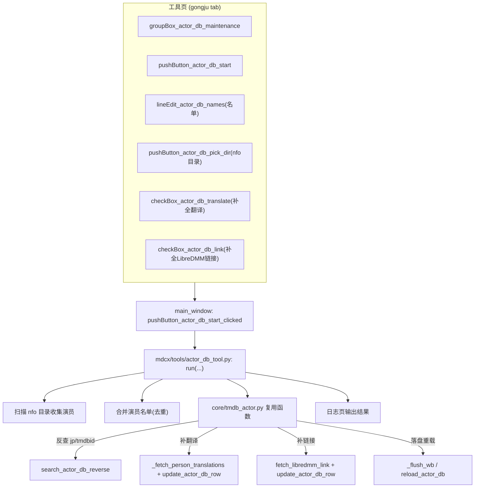

# 演员库维护工具（actor-db-maintenance）

Feature Name: actor-db-maintenance
Updated: 2026-08-02

## Description

将内嵌在刮削流程 `fetch_actor_tmdb_ids` 中的「翻译补全」（原 `tmdb_actor.py:956-973`）与「LibreDMM 链接补全」（原 `tmdb_actor.py:1077-1097`）抽离为独立的「演员库维护」UI 工具。刮削流程保留「查询 tmdbid 并写入 actor_database.xlsx」的核心职责；翻译与链接补全由用户在「工具」页手动批量触发，支持演员名单输入或 nfo 目录扫描两种方式。

## Architecture



## Components and Interfaces

### 1. 新增 `mdcx/tools/actor_db_tool.py`

与 `scripts/cover_backfill.py` 同层级的独立工具模块，纯异步、无 UI 依赖，供 main_window 槽函数调用。

```
async def run(
    actor_names: list[str],
    translate: bool = True,
    link: bool = True,
    output_dir: Path | None = None,
) -> ActorDbToolResult
```

- `actor_names`: 去重后的演员名列表
- `translate`: 是否执行翻译补全
- `link`: 是否执行 LibreDMM 链接补全
- `output_dir`: 数据目录，用于定位 actor_database.xlsx（默认 `manager.data_folder_path`）
- 内部复用 `core/tmdb_actor.py` 的 `search_actor_db_reverse` / `_fetch_person_translations` / `fetch_libredmm_link` / `update_actor_db_row`，并复用 `fetch_actor_tmdb_ids` 的批量 `_wb` 预加载与 `_flush_wb` 落盘模式
- 返回每个演员的补全状态清单（成功/跳过/失败 + 原因）

### 2. 辅助函数 `collect_actors_from_nfo_dir(dir_path: Path) -> list[str]`

- 递归扫描 `dir_path` 下所有 `.nfo` 文件
- 用 `lxml.etree` 解析 `//actor/name/text()` 收集演员名（复用 `core/nfo.py:445-455` 的解析方式）
- 去重返回

### 3. 修改 `mdcx/core/tmdb_actor.py` — 剥离逻辑

- `fetch_actor_tmdb_ids` 中删除 `_translate_and_update` 定义及 `need_translate` 相关收集（原 897/937/946 行的 `need_translate.append`）
- `fetch_actor_tmdb_ids` 中删除 `missing_link` 收集与 LibreDMM 补全块（原 1077-1097）
- 保留 `_wb` 预加载 / `_flush_wb` / `update_actor_db_row` / `query_single_actor_cached` / `search_actor_db_reverse` / `_fetch_person_translations` / `fetch_libredmm_link` 等函数（供工具复用）
- 删除后同步清理未使用导入（如 `zhconv` 若仅用于 `_translate_and_update`）

### 4. 修改 `mdcx/views/MDCx.ui` + 重新编译 `MDCx.py`

新增 `groupBox_actor_db_maintenance`，放置于工具页封面补图 groupBox 上方。

**UI 布局约束（必须满足，防再次出现显示不全）：**

| 项 | 值 |
|---|---|
| groupBox 名称 | `groupBox_actor_db_maintenance` |
| 位置 | `x=30`，`y=1240`（位于 `groupBox_cover_backfill` 上方，紧接 `groupBox_21` 底部 y=1231） |
| 尺寸 | `width=701`，`height=200` |
| `groupBox_cover_backfill` | 需下移至 `y=1240+200=1440`，避免与新 groupBox 重叠 |
| `groupBox_emby_actor_manager` | 需下移至 `y=1460+200=1660`，避免与新 groupBox 重叠 |
| `scrollAreaWidgetContents_gongju` 高度 | 1580 → **1780**（+200，保证底部完整可见） |

**下移后各 groupBox 布局对照：**

| groupBox | 原 y | 新 y | 底部 |
|---|---|---|---|
| groupBox_21 | 920 | 920 | 1231（不变） |
| **groupBox_actor_db_maintenance（新增）** | — | **1240** | **1440** |
| groupBox_cover_backfill | 1240 | **1440** | 1640 |
| groupBox_emby_actor_manager | 1460 | **1660** | 1750 |
| scrollAreaWidgetContents_gongju | — | — | 高度 **1780**（≥ 1750） |

**控件清单：**

| 控件 | 类型 | 说明 |
|---|---|---|
| `lineEdit_actor_db_names` | QLineEdit | 演员名单输入，占位符「例如：三上悠亚 明日花绮罗」 |
| `pushButton_actor_db_pick_dir` | QPushButton | 选择 nfo 目录，点击后用 QFileDialog 选目录并回填路径 |
| `lineEdit_actor_db_dir` | QLineEdit | 显示已选 nfo 目录（只读或可编辑） |
| `checkBox_actor_db_translate` | QCheckBox | 「补全翻译（中文/繁体）」，默认勾选 |
| `checkBox_actor_db_link` | QCheckBox | 「补全 LibreDMM 链接」，默认勾选 |
| `pushButton_actor_db_start` | QPushButton | 「开始维护」，运行批量任务 |

**信号接线（在 `init.py` 中）：**

```
self.Ui.pushButton_actor_db_start.clicked.connect(self.pushButton_actor_db_start_clicked)
self.Ui.pushButton_actor_db_pick_dir.clicked.connect(self.pushButton_actor_db_pick_dir_clicked)
```

### 5. 修改 `mdcx/controllers/main_window/main_window.py`

新增两个槽函数（参照封面补图实现范式 `pushButton_cover_backfill_start_clicked`）：

- `pushButton_actor_db_start_clicked`：读取名单或目录 → 收集演员 → `executor.submit(asyncio.run, run())` → 日志页输出结果 → 按钮状态恢复
- `pushButton_actor_db_pick_dir_clicked`：`QFileDialog.getExistingDirectory` 选择 nfo 目录并回填

### 6. 修改 `scripts/build.py`

新增 PyInstaller `--hidden-import mdcx.tools.actor_db_tool`（与 emby 模块同样的延迟导入防护，见已有 hidden-import 配置段）。

## Data Models

无新增持久化数据模型。复用现有 `actor_database.xlsx` 结构（`COL_JP/COL_ZH_CN/COL_ZH_TW/COL_KEYWORD/COL_HREF/COL_TMDBID/COL_TMDB_URL`）。

`ActorDbToolResult` 为内存返回结构：

```
class ActorDbToolResult:
    total: int
    translated: int
    linked: int
    skipped: int
    failed: list[tuple[str, str]]  # (actor_name, reason)
```

## Correctness Properties

1. **写锁串行**：工具与刮削并发写 actor_database.xlsx 时，必须经 `_actor_db_write_lock`（`tmdb_actor.py:35`）串行化，防止文件损坏。
2. **不覆盖已有值**：翻译/链接补全遵循 `update_actor_db_row` 的默认语义——已有值不覆盖，仅填空白（翻译补全用 `overwrite_names=True` 保留原行为）。
3. **刮削行为不回归**：剥离后刮削流程仍为匹配到 tmdbid 的演员写库；缺失 zh_cn/zh_tw 或 href 不再触发额外网络请求。
4. **UI 完整性**：`scrollAreaWidgetContents_gongju` 高度与所有 groupBox 的 y+height 严格满足「最后一个 groupBox 底部 ≤ 容器高度」。
5. **结果可见性**：每个演员的处理结果（成功/跳过/失败+原因）必须输出到日志页。

## Error Handling

| 场景 | 处理 |
|---|---|
| 演员名单为空且未选目录 | 日志页提示「请输入演员名单或选择 nfo 目录」并中止 |
| nfo 目录不存在/无 .nfo 文件 | 日志页提示目录无效或未找到 nfo 文件 |
| 演员无 tmdbid | 跳过翻译补全，记录「无 tmdbid」原因 |
| TMDB / LibreDMM 请求失败 | 捕获异常，记录失败原因，继续处理下一演员 |
| openpyxl 缺失 / xlsx 文件锁定 | 复用 `update_actor_db_row` 的返回码（`missing_openpyxl`/`file_locked`），日志页输出明确原因 |
| 写盘失败 | 复用 `_flush_wb` 的「落盘失败不能静默吞掉」原则，日志页输出错误 |

## Test Strategy

1. **单元测试**：`tests/tools/test_actor_db_tool.py`
   - `collect_actors_from_nfo_dir`：构造临时 nfo 目录，验证演员收集与去重
   - `run` 输入空名单 → 返回空结果且不报错
   - `run` 模拟演员已在 actor_database 有 tmdbid 且缺翻译 → 触发翻译补全路径
   - `run` 关闭 translate 选项 → 跳过翻译补全
2. **回归测试**：验证刮削流程 `fetch_actor_tmdb_ids` 剥离后：
   - 匹配到 tmdbid 仍写库
   - 缺失 zh_cn/zh_tw 不再触发 translations 请求
   - 缺失 href 不再触发 LibreDMM 请求
3. **UI 验证**（人工）：工具页滚动到底部，确认 `groupBox_actor_db_maintenance` 与 `groupBox_emby_actor_manager` 完整可见、无重叠
4. **打包验证**（人工）：`scripts/build.py` 打包后运行，确认 `mdcx.tools.actor_db_tool` 可正常导入（hidden-import 生效）

## References

[^1]: (mdcx/core/tmdb_actor.py#L956-L973) - `_translate_and_update` 翻译补全定义，待剥离
[^2]: (mdcx/core/tmdb_actor.py#L1077-L1097) - LibreDMM 链接补全块，待剥离
[^3]: (mdcx/core/tmdb_actor.py#L636-L749) - `update_actor_db_row` 写入函数（复用）
[^4]: (mdcx/core/scraper.py#L887-L889) - `fetch_actor_tmdb_ids` 调用点（保留）
[^5]: (mdcx/core/nfo.py#L445-L455) - nfo 演员节点解析方式（复用）
[^6]: (scripts/cover_backfill.py) - 现有工具实现范式（参照）
[^7]: (mdcx/views/MDCx.ui#L1582-L1588) - `scrollAreaWidgetContents_gongju` 高度 1580（待调整为 1780）
[^8]: (mdcx/views/MDCx.ui#L2411-L2418) - `groupBox_emby_actor_manager` y=1460（待下移至 1660）
[^9]: (mdcx/controllers/main_window/main_window.py#L2562-L2596) - 封面补图槽函数范式（参照）
