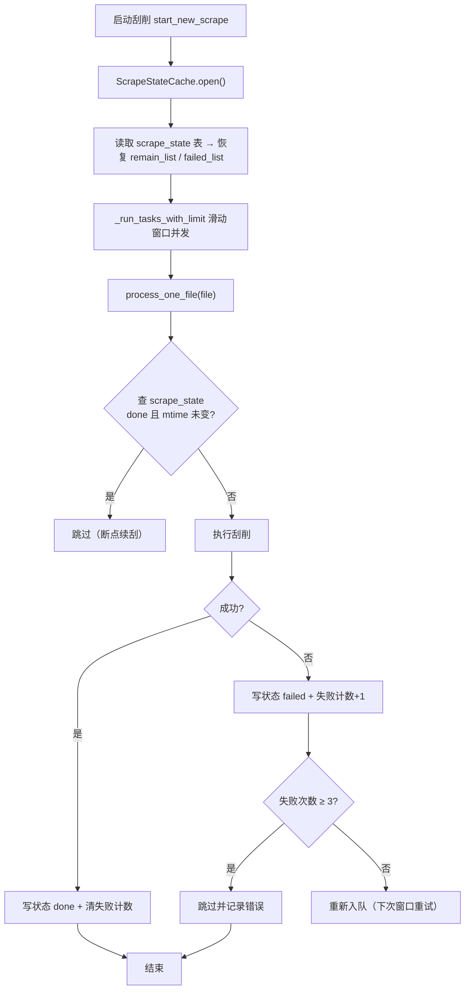

# SQLite 刮削状态缓存层

Feature Name: sqlite-scrape-state-cache
Updated: 2026-08-15

## Description

为 MDCx 刮削流程引入基于 SQLite（标准库 `sqlite3`）的刮削状态缓存层，持久化每个源文件的处理状态，实现**断点续刮**与**失败自动重试**。该缓存是轻量状态层，不做权威数据（权威元数据仍是 NFO，权威演员库仍是 xlsx）。

默认启用，无配置开关；数据库损坏自动回退内存模式。失败重试上限 3 次。数据库文件位于 `manager.data_folder/userdata/scrape_state.db`。

## Architecture



## Components and Interfaces

### `mdcx/core/scrape_cache.py`（新增）

**`ScrapeStateCache`** — SQLite 状态缓存访问层。

```python
class ScrapeStateCache:
    def __init__(self, db_path: Path): ...
    def open(self) -> bool: ...            # 打开 DB（WAL），失败返回 False（回退内存）
    def close(self) -> None: ...
    def is_usable(self) -> bool: ...       # open 是否成功

    def get_state(self, file_path: Path) -> ScrapeState | None:
        """查询单文件状态；无记录返回 None。"""

    def set_done(self, file_path: Path, mtime: float, number: str) -> None:
        """标记刮削成功，清失败计数。"""

    def set_failed(self, file_path: Path, mtime: float, error: str) -> None:
        """标记刮削失败，失败计数 +1。"""

    def should_skip(self, file_path: Path, mtime: float, force: bool) -> bool:
        """断点续刮判断：done 且 mtime 未变且未强制 → True（跳过）。"""

    def should_retry(self, file_path: Path, max_retries: int = 3) -> bool:
        """失败计数 < max_retries → True（重新入队）。"""

    def list_pending(self) -> list[Path]:
        """返回待处理（failed 且未超限 / 无记录）文件。"""

    def cleanup_missing(self, existing: set[Path]) -> None:
        """清理源文件已不存在的过期记录。"""
```

**`ScrapeState`** — dataclass：

```python
@dataclass
class ScrapeState:
    file_path: str      # 源文件绝对路径
    mtime: float        # 处理时的源文件 mtime
    status: str         # "done" / "failed"
    number: str         # 刮到的番号（成功时）
    fail_count: int     # 连续失败次数
    scraped_at: float   # 最后处理时间戳
    error: str          # 最后错误信息（失败时）
```

### 接入点（修改现有文件）

| 文件 | 改动 |
|---|---|
| `mdcx/core/scraper.py` | `start_new_scrape` 中 open 缓存并恢复队列；`_run_tasks_with_limit` 中 `process_one_file` 前后读写状态 |
| `mdcx/controllers/main_window/main_window.py` | 刮削完成/停止时 close 缓存 |
| `mdcx/models/flags.py` | 不修改（缓存为独立层，不动 Flags 现有结构） |

## Data Models

### SQLite 表 `scrape_state`

```sql
CREATE TABLE IF NOT EXISTS scrape_state (
    file_path  TEXT PRIMARY KEY,            -- 源文件绝对路径
    mtime      REAL NOT NULL,               -- 处理时源文件 mtime
    status     TEXT NOT NULL,               -- 'done' / 'failed'
    number     TEXT NOT NULL DEFAULT '',    -- 刮到的番号
    fail_count INTEGER NOT NULL DEFAULT 0,  -- 连续失败次数
    scraped_at REAL NOT NULL,               -- 最后处理时间
    error      TEXT NOT NULL DEFAULT ''     -- 最后错误信息
);
```

索引：主键 `file_path` 已覆盖按路径查询；无需额外索引。

DB 连接使用 WAL 模式（`PRAGMA journal_mode=WAL`），支持多读单写并发（刮削是多文件并发写）。

## Correctness Properties

1. **幂等性**：`done` 且 mtime 未变 → 跳过；mtime 变化 → 重新刮削（文件被替换后不残留旧状态）
2. **失败上限**：`fail_count >= 3` → 不自动重试，仅手动强制
3. **成功清零**：成功写 `done` 时 `fail_count` 归零
4. **回退安全**：DB 打开失败 → `is_usable() == False` → 全部走内存逻辑，行为与现状一致
5. **删除可重建**：DB 文件删除 → 下次自动建空表，无缝继续
6. **不触碰权威数据**：不写入 NFO / xlsx 的任何内容，仅持久化刮削过程状态

### 已确认的设计决策

- **跳过语义**：断点续刮时，`done` 且 mtime 未变 → **直接不调用 `process_one_file`**（在 `_run_tasks_with_limit` 提交任务前过滤），最大省时
- **重试时机**：失败文件**本轮跳过**，状态表记 `failed`，**下次启动刮削时**重新入队（跨会话重试，避免当轮重复撞同一网络错误拖慢整体）
- **清理时机**：`cleanup_missing` 在**每次刮削开始时**清理源文件已不存在的过期记录

## Error Handling

| 场景 | 处理 |
|---|---|
| DB 文件损坏 / 无法打开 | `open()` 返回 False → `is_usable()` False → 回退内存模式，记日志 |
| 单条写入失败 | try/except 吞掉并记日志，不中断刮削主流程（缓存是尽力而为） |
| 并发写冲突（`database is locked`） | WAL 模式下重试一次；仍失败则跳过该条记录 |
| 源文件已不存在（过期记录） | `cleanup_missing()` 在刮削开始时清理 |
| 首次运行无 DB 文件 | 自动创建空表 |

## Test Strategy

1. **单元测试 `tests/test_scrape_cache.py`**（不依赖 GUI）：
   - `set_done`/`should_skip`：mtime 未变跳过、mtime 变化重刮
   - `set_failed`/`should_retry`：失败计数递增、达上限不再重试、成功清零
   - DB 损坏回退：写入非法字节后 `open()` 返回 False
   - WAL 模式生效：`PRAGMA journal_mode` 返回 `wal`
   - 删除重建：删 DB 文件后再次 open 正常
2. **集成测试**：mock `process_one_file`，验证 `_run_tasks_with_limit` 中跳过逻辑与失败重入队
3. **回归**：现有刮削测试全量通过（缓存默认路径不干扰）

## References

[^1]: (文件) - [mdcx/models/flags.py](../../../../mdcx/models/flags.py) — 现有内存状态 Flags dataclass，本功能不动其结构
[^2]: (文件) - [mdcx/core/scraper.py#L97](../../../../mdcx/core/scraper.py#L97) — `_run_tasks_with_limit` 滑动窗口并发主循环，接入点
[^3]: (文件) - [mdcx/config/resources.py#L106](../../../../mdcx/config/resources.py#L106) — `_userdata_base = manager.data_folder / "userdata"`，DB 存放位置依据
